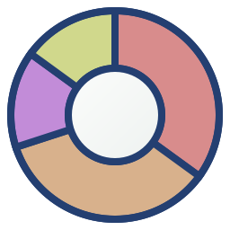

# Jowna - Data Visualizer



- Project: <https://github.com/owebeeone/jowna>
- Live demo: <https://owebeeone.github.io/jowna>
- Inspired by Krona: <https://github.com/marbl/Krona/wiki>

## Status

Jowna is currently **alpha software**.

The project is usable for exploration and export workflows, but behavior and file formats can still
evolve.

## What Jowna Is

Jowna is a browser-first hierarchical data visualizer in the spirit of Krona, but without a Perl
installation or a local CLI pipeline for everyday use.

Key differences from traditional Krona workflows:

- runs directly in the browser
- project data is managed locally in browser storage
- interactive chart + import workflow in one app
- easy export to standalone HTML/SVG/project bundles

## Core Concepts

- **Project**: container for datasets and project-level chart settings
- **Dataset**: parsed source rows + hierarchical tree + warnings
- **Chart view**: interactive radial hierarchy with focus/hover/history controls
- **Import tool**: parse configuration + preview + warning reporting

## Features

- Create/copy/rename/delete projects
- Rename datasets inline
- Import multiple files in one batch via Import Tool
- Import CSV/TSV/JSON with configurable parse parameters
- Upload and import **Krona HTML** as project data
- Preview parsed rows before loading
- Best-effort parsing with warnings (instead of hard-failing on most row issues)
- Chart navigation: click wedges, breadcrumbs, Back/Forward/Up/Reset, depth control
- Chart display settings: border, stroke, collapse, typography, dimensions
- Project-level persisted chart settings
- Dataset selector in chart view (for multi-dataset projects)
- Exports:
  - **Download Project** (`.jowna`) for full project transfer/backup
  - **Download Zip** for all datasets as TSV files
  - **Download Dataset** JSON for individual dataset payloads
  - **Download HTML** standalone interactive chart page
  - **Download SVG** current chart snapshot

## Local Storage And Sharing

Project data is stored on the host browser (IndexedDB/local browser storage).

That storage is local and can be cleared by browser/site-data cleanup.  
For persistence and sharing:

- use **Download Project** to keep a portable `.jowna` file
- copy/share that `.jowna` file with collaborators
- use **Upload Project** on another machine/browser to restore it

`Download Project` preserves datasets and chart settings.

## Quick Start

1. Open Jowna.
2. Create a project.
3. Open **Import Tool**.
4. Select one or more files (or load URL).
5. Configure parse parameters.
6. Click **Preview Parse**.
7. Click **Load now**.
8. Open chart view.
9. Tune chart settings and depth.
10. Export Project/Zip/HTML/SVG as needed.

## Import Notes

Supported parse formats:

- `auto`
- `tsv`
- `csv`
- `json-hierarchy`
- `json-flat`

Configurable parameters include:

- delimiter
- header-row behavior
- comment prefix
- magnitude field
- path fields
- URL/description fields
- attribute fields

## Standalone HTML Export

`Download HTML` produces a single-file chart page that includes:

- chart settings
- project datasets
- dataset selection
- interactive navigation

This is useful for sharing chart views with users who should not need the full app runtime.

## Development

### Requirements

- Node.js + npm
- `rsync` (for docs publishing flow)
- Python 3 (for publish/release helper script)

### Run locally

```bash
npm install
npm run dev
```

### Build and validate

```bash
npm run build
npm run format
npm run typecheck
npm run test
```

## Publishing (GitHub Pages)

Jowna is path-hosted at `/jowna/`.

Publish with:

```bash
npm run publish:site
```

This runs `tools/publish.py` to build, version/tag, merge/push publish branch updates, and deploy
docs artifacts.

## Tech Stack

- React + TypeScript + Vite
- `@owebeeone/grip-react` (grips/taps)
- `papaparse` (CSV/TSV parsing)
